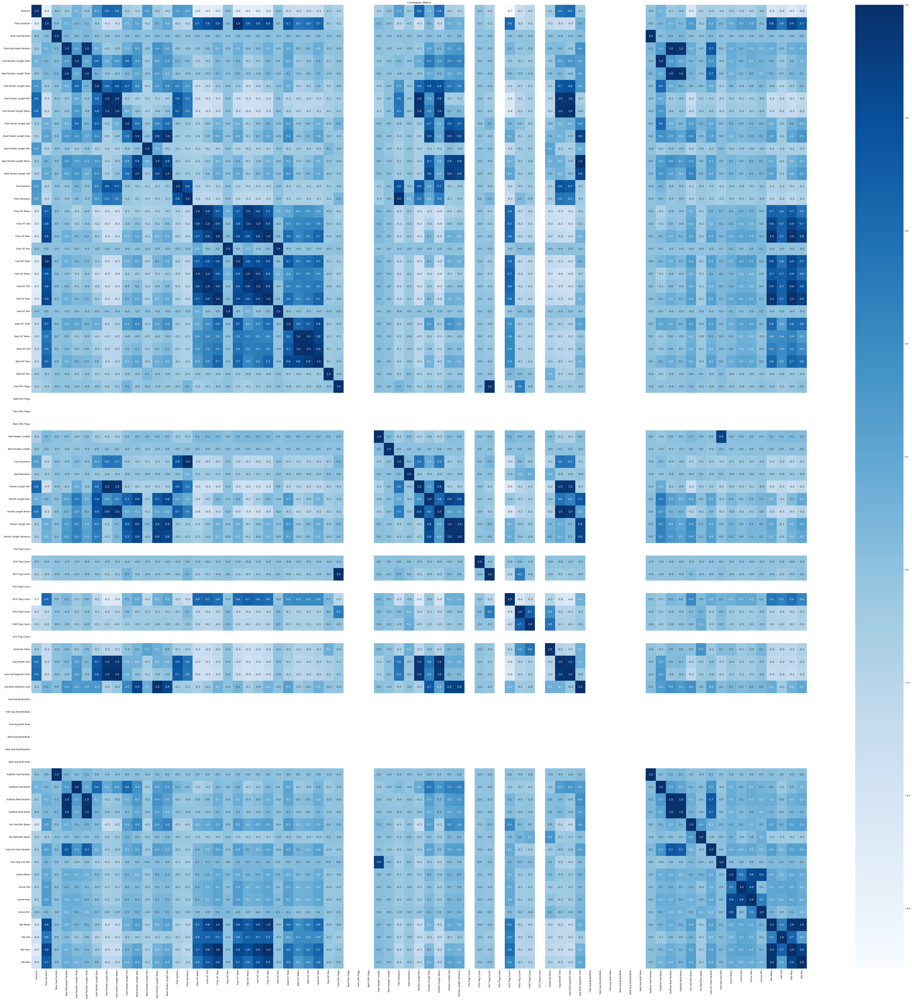

## DDoS Defense: A Multiclass and Multidimensional Detection System with Diverse Machine Learning Models

### Project Overview
This project is focused on building a system to detect and classify **DDoS (Distributed Denial of Service)** attacks using the **CICDDoS2019** dataset. The goal is to develop a multiclass classification model that can identify various DDoS attacks from normal network traffic. The dataset consists of multiple attack types with different network traffic characteristics, making it a challenging problem for DDoS detection.

### Dataset Description
The **CICDDoS2019** dataset, provided by the Canadian Institute for Cybersecurity (CIC), contains network traffic data representing several types of DDoS attacks along with benign (non-attack) traffic. The dataset features several attributes like packet size, source/destination IPs, and protocol types. The target variable consists of different attack labels as follows:

### Project Overview

This project is focused on building a system to detect and classify **DDoS (Distributed Denial of Service)** attacks using the **CICDDoS2019** dataset. The goal is to develop a multiclass classification model that can identify various DDoS attacks from normal network traffic. The dataset consists of multiple attack types with different network traffic characteristics, making it a challenging problem for DDoS detection.

### Dataset Description

The **CICDDoS2019** dataset, provided by the Canadian Institute for Cybersecurity (CIC), contains network traffic data representing several types of DDoS attacks along with benign (non-attack) traffic. The dataset features several attributes like packet size, source/destination IPs, and protocol types. The target variable consists of different attack labels as follows:

- **Syn**: SYN flood attack
- **Benign**: Normal, non-attack traffic
- **Portmap**: Portmapper-based DDoS attack
- **UDP**: Generic UDP flood attack
- **UDPLag**: UDP-based DDoS with lag
- **MSSQL**: MSSQL-specific DDoS attack
- **NetBIOS**: NetBIOS-related DDoS attack
- **LDAP**: Lightweight Directory Access Protocol-based attack

### Process Overview

#### Data Collection and Preprocessing
1. **Collecting Data Paths**:
   - The paths of training and testing datasets are collected using a file walk through. 
   - We ensure that only the datasets with matching names are used for training and testing.

2. **Data Processing**:
   - **Column Mapping**: We map the column names between the training and testing datasets, ensuring they are consistent. The column names in the testing set are renamed to match the training set.
   - **Null and Duplicate Handling**: We check for any null or duplicate values. No null values are found, and any duplicates in the dataset are removed.
   - **Removing Single Unique Value Columns**: Columns with only a single unique value are dropped as they do not provide meaningful information for classification.
   - **Removing Highly Correlated Columns**: Columns with a correlation coefficient of 0.8 or higher are dropped to reduce multicollinearity and improve model performance.

#### Exploratory Data Analysis (EDA)
Several key visualizations were performed to understand the dataset:

- **Distribution of Categorical Columns**: 
   - Frequency distribution using bar plots and percentage distribution using pie charts for categorical features.

      

- **Flow Duration Distribution**: 
   - Analyzing the flow duration distribution for both DDoS and normal traffic.

   
- **Packet Length Mean by Protocol and Attack Label**: 
   - Exploring the average packet length by protocol type and attack label.

   
- **Flags Distribution by Attack Label**: 
   - Distribution of different flag types across attack labels.

   
- **Protocol Requests Distribution**: 
   - Number of requests coming from different protocols.

   
- **Correlation Matrix**: 
   - A heatmap to visualize the correlation matrix and identify relationships between features.

   

#### Data Preprocessing and Feature Engineering
- **Train-Test Split**: 
   - The dataset is split into training, validation, and test sets to ensure proper evaluation of the model.
- **Feature Encoding**: 
   - The target column is encoded using **LabelEncoder** to convert categorical labels into numerical values for training.
- **Feature Scaling**: 
   - We apply **Min-Max Scaling** to scale the features to a uniform range, improving the performance of distance-based algorithms.

#### Model Training and Evaluation
- **Model Selection**: 
   - Several models are trained and evaluated for multiclass classification, including:
     - **Random Forest**
     - **K-Nearest Neighbors (KNN)**
     - **Extra Trees Classifier**
     - **Multi-Layer Perceptron (MLP) Classifier**
     - **XGBoost**
   
- **Model Evaluation**:
   - We evaluate the models using various performance metrics like **accuracy**, **precision**, **recall**, **F1-score**, and **ROC AUC**.
   - ROC curves are plotted to compare the performance of each model across different classes.
   - A table of the model scores is created and displayed for easy comparison.

#### Results Visualization
- **Model Comparison**: 
   - We plot the **accuracy score** for each model to visually compare their performance.
   - ROC curves for all models are plotted to analyze their classification ability, especially for multiclass classification tasks.

### Key Observations

#### 1. Best Overall Model
- **Random Forest**:
  - Accuracy: **0.992684**
  - Recall: **0.992684**
  - F1 Score: **0.992604**
  - ROC AUC: **0.991172**
  - This model performs consistently well across all metrics, making it the best choice for DDoS prediction.

#### 2. Model with Best ROC AUC
- **MLP Classifier**:
  - ROC AUC: **0.995034**
  - Although its accuracy and F1 score are slightly lower, the high ROC AUC indicates its strength in distinguishing between DDoS and non-DDoS traffic.

#### 3. Performance Trade-offs
- **XGBoost**:
  - Accuracy: **0.991615**
  - Precision: **0.991619**
  - F1 Score: **0.991595**
  - While competitive, it slightly lags behind Random Forest in overall performance.
  
- **KNN**:
  - ROC AUC: **0.983761**
  - This model has the lowest ROC AUC score, suggesting challenges in distinguishing between classes.

#### 4. Cross-validation Scores
- All models demonstrate strong generalization capabilities with high CV scores.
- **Extra Trees** achieves the highest CV score (**0.992973**), indicating excellent consistency.

#### 5. Extra Trees vs. Random Forest
- Both models perform similarly, but **Random Forest** slightly outperforms Extra Trees in accuracy, recall, and F1 score.

#### 6. MLP Classifier
- While slightly behind in accuracy and F1 score, its superior ROC AUC (**0.995034**) makes it a strong contender for scenarios requiring robust class separation.

### Recommendation
- **Random Forest** is the best choice for DDoS prediction due to its balanced performance across all metrics.
- **MLP Classifier** can be considered for scenarios prioritizing the ability to distinguish between DDoS and non-DDoS traffic (as indicated by the ROC AUC score).

### Model Export

We saved the **Random Forest** model using **pickle** for future development and deployment. This allows us to persist the model after training and load it later without retraining. The exported model can be used for making predictions on new data.

### Conclusion

Through this project, we evaluated several machine learning models for DDoS attack detection, aiming to identify the most effective model for classifying various types of DDoS attacks. The results provide insights into the performance of each model, and can help in building more robust cybersecurity systems that are capable of detecting and defending against DDoS attacks in real-world networks.

For more information about the dataset, you can visit the official [CICDDoS2019 Dataset Page](https://www.unb.ca/cic/datasets/ddos-2019.html).
